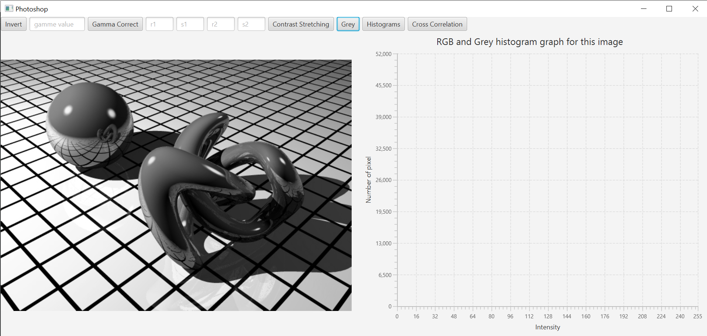

# Computer Graphics
This is a Java individual program.
It have 6 functions in total.

## (1) Invert
Invert the pixel values of the images

## (2) Gamma correction
Takes in a gamma value

## (3) Contrast Stretching
Takes in 2 coordinates as a parameter

## (4) Grey
Turns an image into grey scale

## (5) Histogram equalisation
Make changes to the brightness of the image

## (6) Cross correlation
Edge detector

Home Screen of the photoshop:

